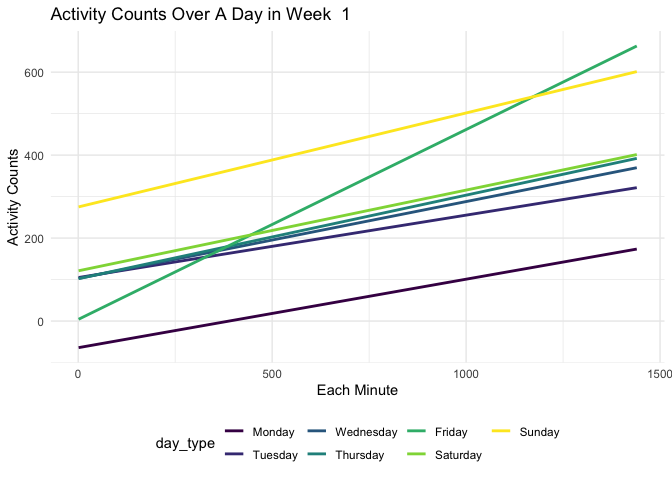

p8105_hw3_ys3637
================
Youlan Shen
2022-10-15

``` r
# library all packages that we need at the beginning
library(tidyverse)
```

    ## ── Attaching packages ─────────────────────────────────────── tidyverse 1.3.2 ──
    ## ✔ ggplot2 3.3.6      ✔ purrr   0.3.4 
    ## ✔ tibble  3.1.8      ✔ dplyr   1.0.10
    ## ✔ tidyr   1.2.0      ✔ stringr 1.4.1 
    ## ✔ readr   2.1.2      ✔ forcats 0.5.2 
    ## ── Conflicts ────────────────────────────────────────── tidyverse_conflicts() ──
    ## ✖ dplyr::filter() masks stats::filter()
    ## ✖ dplyr::lag()    masks stats::lag()

``` r
library(ggridges)

# default set up
theme_set(theme_minimal() + theme(legend.position = "bottom"))

options(
  ggplot2.continuous.colour = "viridis",
  ggplot2.continuous.fill = "viridis"
)

scale_colour_discrete = scale_colour_viridis_d
scale_fill_discrete = scale_fill_viridis_d
```

## Problem 1

This problem uses the Instacart data. DO NOT include this dataset in
your local data directory; instead, load the data from the
p8105.datasets using:

``` r
library(p8105.datasets)
data("instacart")
```

## Problem 2

Accelerometers have become an appealing alternative to self-report
techniques for studying physical activity in observational studies and
clinical trials, largely because of their relative objectivity. During
observation periods, the devices measure “activity counts” in a short
period; one-minute intervals are common. Because accelerometers can be
worn comfortably and unobtrusively, they produce around-the-clock
observations.

This problem uses five weeks of accelerometer data collected on a 63
year-old male with BMI 25, who was admitted to the Advanced Cardiac Care
Center of Columbia University Medical Center and diagnosed with
congestive heart failure (CHF). The data can be downloaded here. In this
spreadsheet, variables activity.\* are the activity counts for each
minute of a 24-hour day starting at midnight.

### Read in, tidy, and describe the data

Load, tidy, and otherwise wrangle the data. Your final dataset should
include all originally observed variables and values; have useful
variable names; include a weekday vs weekend variable; and encode data
with reasonable variable classes. Describe the resulting dataset
(e.g. what variables exist, how many observations, etc).

``` r
# read in data from CSV file
accel_data <- read_csv("data/accel_data.csv")
```

    ## Rows: 35 Columns: 1443
    ## ── Column specification ────────────────────────────────────────────────────────
    ## Delimiter: ","
    ## chr    (1): day
    ## dbl (1442): week, day_id, activity.1, activity.2, activity.3, activity.4, ac...
    ## 
    ## ℹ Use `spec()` to retrieve the full column specification for this data.
    ## ℹ Specify the column types or set `show_col_types = FALSE` to quiet this message.

``` r
# show the first several lines of the original data
head(accel_data)
```

    ## # A tibble: 6 × 1,443
    ##    week day_id day      activi…¹ activ…² activ…³ activ…⁴ activ…⁵ activ…⁶ activ…⁷
    ##   <dbl>  <dbl> <chr>       <dbl>   <dbl>   <dbl>   <dbl>   <dbl>   <dbl>   <dbl>
    ## 1     1      1 Friday       88.4    82.2    64.4    70.0    75.0    66.3    53.8
    ## 2     1      2 Monday        1       1       1       1       1       1       1  
    ## 3     1      3 Saturday      1       1       1       1       1       1       1  
    ## 4     1      4 Sunday        1       1       1       1       1       1       1  
    ## 5     1      5 Thursday     47.4    48.8    46.9    35.8    49.0    44.8    73.4
    ## 6     1      6 Tuesday      64.8    59.5    73.7    45.7    42.4    58.4    76.8
    ## # … with 1,433 more variables: activity.8 <dbl>, activity.9 <dbl>,
    ## #   activity.10 <dbl>, activity.11 <dbl>, activity.12 <dbl>, activity.13 <dbl>,
    ## #   activity.14 <dbl>, activity.15 <dbl>, activity.16 <dbl>, activity.17 <dbl>,
    ## #   activity.18 <dbl>, activity.19 <dbl>, activity.20 <dbl>, activity.21 <dbl>,
    ## #   activity.22 <dbl>, activity.23 <dbl>, activity.24 <dbl>, activity.25 <dbl>,
    ## #   activity.26 <dbl>, activity.27 <dbl>, activity.28 <dbl>, activity.29 <dbl>,
    ## #   activity.30 <dbl>, activity.31 <dbl>, activity.32 <dbl>, …

``` r
# clean, tidy, wrangle the data
accel_data <- accel_data %>% 
  janitor::clean_names() %>% 
  rename(day_type = day) %>% 
  pivot_longer(
    c(activity_1:activity_1440),
    names_to = "minute", 
    values_to = "activity_counts",
    names_prefix = 'activity_') %>% 
  mutate(
    weekday_vs_weekend = ifelse((day_type == "Saturday" | day_type == "Sunday"), "weekend", "weekday"),
    activity_counts = as.double(activity_counts),
    minute = as.integer(minute))
# show the cleaned data
accel_data
```

    ## # A tibble: 50,400 × 6
    ##     week day_id day_type minute activity_counts weekday_vs_weekend
    ##    <dbl>  <dbl> <chr>     <int>           <dbl> <chr>             
    ##  1     1      1 Friday        1            88.4 weekday           
    ##  2     1      1 Friday        2            82.2 weekday           
    ##  3     1      1 Friday        3            64.4 weekday           
    ##  4     1      1 Friday        4            70.0 weekday           
    ##  5     1      1 Friday        5            75.0 weekday           
    ##  6     1      1 Friday        6            66.3 weekday           
    ##  7     1      1 Friday        7            53.8 weekday           
    ##  8     1      1 Friday        8            47.8 weekday           
    ##  9     1      1 Friday        9            55.5 weekday           
    ## 10     1      1 Friday       10            43.0 weekday           
    ## # … with 50,390 more rows

This dataset contains 50400 rows and 6 columns, while each row showing
an activity measure in a single minute during the 5-week data collection
period. Variables include week (from the first week to the fifth week),
day_id(from the first day to the 35th day), day_type (includes Monday to
Sunday), minute (every minute in a single day), activity_counts (the
count that is recorded in the accelerometer), and weekday_vs_weekend
(which distinguishs weekdays and weekend). There are total 50400
observations, which are the activity measures from every minute in a day
during the 5-week period.

### Traditional analyses on total activity counts over a day

The following table shows the total activity counts for each day in this
study period in descending order. In general, we can see from the table
that there is a huge difference between different days, the highest
counts could be 685929 while the lowest is 1440, so the range is very
huge. By including weekday vs weekend variable, we could see that
usually the person has high activity counts on weekdays. But there is
not much difference over different weeks.

``` r
accel_data %>% 
  group_by(day_id, weekday_vs_weekend, week) %>% 
  summarize(total_activity = sum(activity_counts)) %>% 
  arrange(desc(total_activity)) %>% 
  knitr::kable()
```

    ## `summarise()` has grouped output by 'day_id', 'weekday_vs_weekend'. You can
    ## override using the `.groups` argument.

| day_id | weekday_vs_weekend | week | total_activity |
|-------:|:-------------------|-----:|---------------:|
|     16 | weekday            |    3 |      685910.00 |
|      4 | weekend            |    1 |      631105.00 |
|     29 | weekday            |    5 |      620860.00 |
|     10 | weekend            |    2 |      607175.00 |
|      8 | weekday            |    2 |      568839.00 |
|     33 | weekday            |    5 |      549658.00 |
|      1 | weekday            |    1 |      480542.62 |
|     12 | weekday            |    2 |      474048.00 |
|     21 | weekday            |    3 |      468869.00 |
|     15 | weekday            |    3 |      467420.00 |
|     18 | weekend            |    3 |      467052.00 |
|     35 | weekday            |    5 |      445366.00 |
|     14 | weekday            |    2 |      440962.00 |
|     28 | weekday            |    4 |      434460.00 |
|     13 | weekday            |    2 |      423245.00 |
|     11 | weekend            |    2 |      422018.00 |
|     23 | weekday            |    4 |      409450.00 |
|     30 | weekday            |    5 |      389080.00 |
|     17 | weekend            |    3 |      382928.00 |
|     20 | weekday            |    3 |      381507.00 |
|      3 | weekend            |    1 |      376254.00 |
|     19 | weekday            |    3 |      371230.00 |
|     34 | weekday            |    5 |      367824.00 |
|      5 | weekday            |    1 |      355923.64 |
|     26 | weekday            |    4 |      340291.00 |
|      7 | weekday            |    1 |      340115.01 |
|     27 | weekday            |    4 |      319568.00 |
|      6 | weekday            |    1 |      307094.24 |
|      9 | weekday            |    2 |      295431.00 |
|     25 | weekend            |    4 |      260617.00 |
|     22 | weekday            |    4 |      154049.00 |
|     32 | weekend            |    5 |      138421.00 |
|      2 | weekday            |    1 |       78828.07 |
|     24 | weekend            |    4 |        1440.00 |
|     31 | weekend            |    5 |        1440.00 |

### Draw a graph of activity

``` r
# produce the week 1 graph
graph_produce <- function(x, a){
  x %>%
  filter(week == a) %>% 
  mutate(day_type = forcats::fct_relevel(day_type, c("Monday", "Tuesday",
        "Wednesday", "Thursday", "Friday", "Saturday", "Sunday"))) %>% 
  ggplot(aes(x = minute, y = activity_counts, color = day_type)) +
  geom_smooth(method = "lm", se = FALSE) +
  labs(
    title = paste("Activity Counts Over A Day in Week ", as.character(a)),
    x = "Each Minute",
    y = "Activity Counts"
  )
}
graph_produce(accel_data, 1)
```

    ## `geom_smooth()` using formula 'y ~ x'

<!-- -->

``` r
# produce the week 2 graph
graph_produce(accel_data, 2)
```

    ## `geom_smooth()` using formula 'y ~ x'

<!-- -->

``` r
# produce the week 3 graph
graph_produce(accel_data, 3)
```

    ## `geom_smooth()` using formula 'y ~ x'

<!-- -->

``` r
# produce the week 4 graph
graph_produce(accel_data, 4)
```

    ## `geom_smooth()` using formula 'y ~ x'

<!-- -->

``` r
# produce the week 5 graph
graph_produce(accel_data, 5)
```

    ## `geom_smooth()` using formula 'y ~ x'

<!-- -->

``` r
# produce the total period graph
accel_data %>%
  mutate(day_type = forcats::fct_relevel(day_type, c("Monday", "Tuesday",
        "Wednesday", "Thursday", "Friday", "Saturday", "Sunday"))) %>% 
  ggplot(aes(x = minute, y = activity_counts, color = day_type)) +
  geom_smooth(method = "lm", se = FALSE) +
  labs(
    title = "Activity Counts Over A Day in Total 5 Weeks",
    x = "Each Minute",
    y = "Activity Counts",
  )
```

    ## `geom_smooth()` using formula 'y ~ x'

<!-- -->

From the graph, the person tends to have higher activity counts over the
weekdays, especially Friday, Thursday, and Wednesday, and over the
weekend, the person tends to have lower activity counts. These 5 weeks
are kind of different from each other, but in general, the person has a
similar pattern–Friday usually has the highest activity counts, and
Saturday usually has the lowest activity counts, weekday activity counts
are higher than the weekend.

## Problem 3

``` r
library(p8105.datasets)
data("ny_noaa")
```

The goal is to do some exploration of this dataset. To that end, write a
short description of the dataset, noting the size and structure of the
data, describing some key variables, and indicating the extent to which
missing data is an issue.

#### Read in the data

``` r
data("ny_noaa")

ny_noaa = 
  ny_noaa %>% 
  as_tibble(ny_noaa)

# count the rows of the data
n <- nrow(ny_noaa)
# show the data
ny_noaa
```

    ## # A tibble: 2,595,176 × 7
    ##    id          date        prcp  snow  snwd tmax  tmin 
    ##    <chr>       <date>     <int> <int> <int> <chr> <chr>
    ##  1 US1NYAB0001 2007-11-01    NA    NA    NA <NA>  <NA> 
    ##  2 US1NYAB0001 2007-11-02    NA    NA    NA <NA>  <NA> 
    ##  3 US1NYAB0001 2007-11-03    NA    NA    NA <NA>  <NA> 
    ##  4 US1NYAB0001 2007-11-04    NA    NA    NA <NA>  <NA> 
    ##  5 US1NYAB0001 2007-11-05    NA    NA    NA <NA>  <NA> 
    ##  6 US1NYAB0001 2007-11-06    NA    NA    NA <NA>  <NA> 
    ##  7 US1NYAB0001 2007-11-07    NA    NA    NA <NA>  <NA> 
    ##  8 US1NYAB0001 2007-11-08    NA    NA    NA <NA>  <NA> 
    ##  9 US1NYAB0001 2007-11-09    NA    NA    NA <NA>  <NA> 
    ## 10 US1NYAB0001 2007-11-10    NA    NA    NA <NA>  <NA> 
    ## # … with 2,595,166 more rows

``` r
# count the NAs
ny_noaa %>% 
  summarise(na_prcp = sum(is.na(prcp)) / n,
            na_snow = sum(is.na(snow)) / n,
            na_snwd = sum(is.na(snwd)) / n,
            na_tmax = sum(is.na(tmax)) / n,
            na_tmin = sum(is.na(tmin)) / n)
```

    ## # A tibble: 1 × 5
    ##   na_prcp na_snow na_snwd na_tmax na_tmin
    ##     <dbl>   <dbl>   <dbl>   <dbl>   <dbl>
    ## 1  0.0562   0.147   0.228   0.437   0.437

This dataset contains 2595176 rows and 7 columns, while each row showing
the weather measures in a specific date recorded in weather station.
Variables include id (the weather station ID), date (the date that
weather data observed), prcp (precipitaion on that day), snow (snowfall
in mm), snwd (snow depth in mm), tmax (maximum temperature in C), and
tmin (minimum temperature in C). There are total 2595176 observations,
which are the weather data recorded in a time period.

From the above Count The NAs result, the percentage of NAs in prcp is
0.0562, which is not a big issue. The percentage of NAs in snow is
0.147, in snwd is 0.228, in tmax is 0.437, in tmin is 0.437. I think
that the percentage of NAs in a data over 0.05 could be considered as an
issue, so actually snow, snwd, tmax, and tmin have issues with missing
values, especially tmax and tmin–lost almost half of the data.

#### Clean the data

``` r
# separate variables for year, month, and day
ny_noaa <- ny_noaa %>% 
  janitor::clean_names() %>% 
  separate(date, into = c("year", "month", "day"), sep = "-")
# Ensure observations for temperature, precipitation, and snowfall are given in reasonable units
ny_noaa <- ny_noaa %>% 
  mutate(prcp = as.double(prcp), tmax = as.double(tmax), 
         tmin = as.double(tmin), snow = as.double(snow))
ny_noaa %>% 
  arrange(desc(snow)) %>% 
  head()
```

    ## # A tibble: 6 × 9
    ##   id          year  month day    prcp  snow  snwd  tmax  tmin
    ##   <chr>       <chr> <chr> <chr> <dbl> <dbl> <int> <dbl> <dbl>
    ## 1 USC00309516 1983  04    11       20 10160     0    NA    NA
    ## 2 USC00303124 1987  04    29       30  7765   787    61     6
    ## 3 USC00301623 1983  11    27        0  7122    76    78     6
    ## 4 USC00305639 1987  01    02      711  6350  7620    NA    NA
    ## 5 USC00303851 1988  01    06      754  1207  1524    NA    NA
    ## 6 USW00094790 1995  12    10      574  1143   127   -56  -111

``` r
# show the most commonly observed values in snow
ny_noaa %>% 
  select(snow) %>% 
  group_by(snow) %>% 
  summarise(count = n()) %>% 
  arrange(desc(count))
```

    ## # A tibble: 282 × 2
    ##     snow   count
    ##    <dbl>   <int>
    ##  1     0 2008508
    ##  2    NA  381221
    ##  3    25   31022
    ##  4    13   23095
    ##  5    51   18274
    ##  6    76   10173
    ##  7     8    9962
    ##  8     5    9748
    ##  9    38    9197
    ## 10     3    8790
    ## # … with 272 more rows

So the most commonly observed values in snow is 0, NA, 25, 13, 51, 76,
8, 5, 38, 3 in mm.

### Make a two-panel plot showing the average max temperature in January and in July

``` r
ny_noaa %>% 
  select(id, month, tmax) %>% 
  filter(month == "01" | month == "07") %>% 
  group_by(id, month) %>% 
  summarise(avg_tmax = mean(tmax))
```

    ## `summarise()` has grouped output by 'id'. You can override using the `.groups`
    ## argument.

    ## # A tibble: 1,336 × 3
    ## # Groups:   id [719]
    ##    id          month avg_tmax
    ##    <chr>       <chr>    <dbl>
    ##  1 US1NYAB0001 01          NA
    ##  2 US1NYAB0001 07          NA
    ##  3 US1NYAB0006 01          NA
    ##  4 US1NYAB0006 07          NA
    ##  5 US1NYAB0010 01          NA
    ##  6 US1NYAB0010 07          NA
    ##  7 US1NYAB0016 07          NA
    ##  8 US1NYAB0017 07          NA
    ##  9 US1NYAB0021 01          NA
    ## 10 US1NYAB0021 07          NA
    ## # … with 1,326 more rows

### Make a two-panel plot showing (i) tmax vs tmin for the full dataset

### Make a two-panel plot showing (ii) make a plot showing the distribution of snowfall values greater than 0 and less than 100 separately by year.
